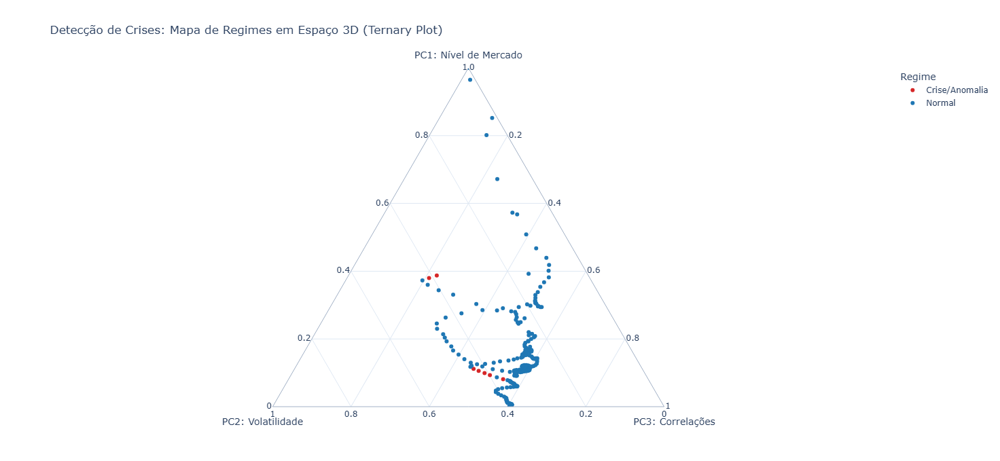

# Pipeline Quantitativo: Monitoramento e Detecção de Crises em Commodities

O objetivo deste repositório é automatizar a extração de dados históricos e atuais de 14 commodities e aplicar técnicas de *Machine Learning* não supervisionado para identificar autônoma e matematicamente os regimes de crise financeira global.

## Estrutura do Repositório

O projeto foi organizado seguindo padrões de engenharia de dados, separando o código-fonte dos dados gerados. A execução dos scripts na pasta `src/` segue uma ordem cronológica lógica.

```text
commodities-pipeline/
├── .github/workflows/
│   └── pipeline.yml             # Orquestração da automação na nuvem (GitHub Actions)
├── data/                        # Armazenamento de todos os arquivos de dados (.csv)
│   ├── monthly_commodities.csv  # Base unificada e atualizada via APIs
│   ├── rolling_windows.csv      # Dataset transformado em janelas de 36 meses
│   ├── raw_features.csv         # Matriz de alta dimensionalidade gerada pelo TSFresh
│   └── crisis_regimes.csv       # Resultados com Scores de Anomalia e Componentes do PCA
├── image/                       # Recursos visuais para documentação
│   └── ternary_plot.png         # Gráfico 3D mapeando os regimes de mercado
├── src/                         # Código-fonte Python
│   ├── 1_data_collection.py     # Coleta incremental e tratamento de dados das APIs
│   ├── 2_sliding_window.py      # Aplica o fatiamento temporal (Rolling Windows)
│   ├── 3_feature_extraction.py  # Processamento paralelo para extração de features
│   ├── 4_crisis_modeling.py     # Aplica o modelo Isolation Forest e PCA
│   ├── 5_model_validation.py    # Validação histórica: cruza anomalias com datas
│   └── 6_plot_results.py        # Gera o Ternary Plot interativo com os resultados
├── README.md                    # Documentação principal do projeto
├── main.py                      # Orquestrador do pipeline (Executa os scripts na ordem correta)
└── requirements.txt             # Dependências do Python (tsfresh, scikit-learn, plotly, etc.)
```

## Arquitetura do Projeto

O projeto é dividido em duas fases principais operando de forma 100% automatizada.

### Fase 1: Engenharia de Dados (Coleta e Tratamento)
- **Extração Híbrida**: Coleta de dados via API do **FRED** (Federal Reserve Economic Data) e **Alpha Vantage** (via Yahoo Finance).
- **Atualização Incremental**: O script verifica a última data no arquivo CSV e faz o download apenas dos dados novos, evitando duplicados.
- **Tratamento de Dados**: Conversão automática de frequências (diário/semanal) para média mensal consolidada, lidando com alinhamento de índices temporais e fuso horário.

### Fase 2: Machine Learning e Detecção de Anomalias
- **Rolling Windows**: Fatiamento das séries temporais em janelas deslizantes de 36 meses, mapeando a evolução do mercado.
- **Extração de Alta Dimensionalidade e Performance**: Utilização da biblioteca `tsfresh` com processamento paralelo multicore para extrair mais de 10.000 características (features) estatísticas, temporais e espectrais por janela.
- **Modelagem Matemática**: 
  - **Isolation Forest**: Algoritmo não supervisionado que analisa a matriz de alta dimensão para isolar períodos anômalos.
  - **PCA**: Redução das dimensões para 3 componentes principais (Nível, Volatilidade e Correlações).
- **Visualização 3D**: Geração automatizada de um *Ternary Plot* para análise espacial dos regimes.

## Ativos Monitorizados
O pipeline consolida dados mensais de:
- **Energia**: Petróleo WTI e Gás Natural.
- **Metais Industriais**: Cobre, Alumínio, Zinco e Estanho.
- **Metais Preciosos**: Ouro, Platina e Paládio.
- **Agricultura**: Soja, Milho, Trigo e Algodão.
- **Macro**: Dólar Index (DXY).

## Resultados Históricos do Modelo
Ao analisar a matriz tridimensional gerada pelo PCA, o modelo identificou com precisão os piores choques econômicos sem nenhuma rotulagem prévia:
1. **2008 - 2010**: Crise Financeira Global (*Subprime*).
2. **2000 - 2003**: Estouro da Bolha das PontoCom e recessão.
3. **2022 - 2026**: Quebra de correlações gerada pelo choque global de oferta de energia.

### Top Janelas de Crise (Isolation Forest)
Abaixo estão as janelas temporais de 36 meses classificadas como as mais anômalas pelo algoritmo, ordenadas pela severidade do choque (quanto mais negativo o *Anomaly Score*, mais crítica foi a disrupção no mercado):

| Data Início (Mês 1) | Data Fim (Mês 36) | Anomaly Score |
| :--- | :--- | :--- |
| 2000-01-31 | 2002-12-31 | -0.055521 |
| 2023-02-28 | 2026-01-31 | -0.042863 |
| 2000-02-29 | 2003-01-31 | -0.037188 |
| 2023-01-31 | 2025-12-31 | -0.036918 |
| 2000-03-31 | 2003-02-28 | -0.034822 |
| 2000-05-31 | 2003-04-30 | -0.026486 |
| 2000-06-30 | 2003-05-31 | -0.025224 |
| 2000-04-30 | 2003-03-31 | -0.022514 |
| 2007-04-30 | 2010-03-31 | -0.010884 |
| 2007-09-30 | 2010-08-31 | -0.010660 |
| 2007-08-31 | 2010-07-31 | -0.007246 |
| 2007-07-31 | 2010-06-30 | -0.006003 |
| 2007-06-30 | 2010-05-31 | -0.003304 |
| 2006-09-30 | 2009-08-31 | -0.000725 |



## Automação via GitHub Actions
A orquestração do pipeline ocorre inteiramente na nuvem:
- **Toda sexta-feira (20h)**: Executa a Fase 1, garantindo que o CSV local esteja sempre atualizado com os fechamentos semanais.
- **Todo dia 1º do mês**: Executa a Fase 2, consolidando as médias do mês anterior, extraindo as *features* e re-treinando o modelo para detectar novos desvios de regime.

## Tecnologias Utilizadas
- **Linguagem**: Python 3.10+
- **Bibliotecas Base**: Pandas, NumPy
- **Machine Learning**: Scikit-Learn (Isolation Forest, PCA), TSFresh
- **Visualização**: Plotly
- **Orquestração**: GitHub Actions (Cron Jobs)